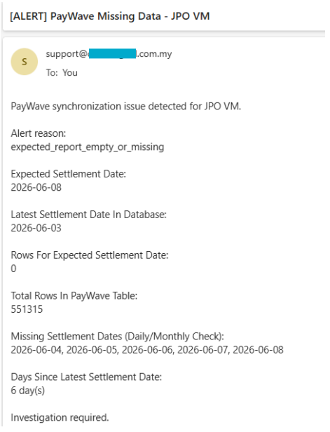

# Paywave Monitor

## Project Overview
Paywave Monitor is a lightweight Python monitoring tool used to detect missing or delayed PayWave settlement data before daily or monthly report issues are reported by clients. It connects directly to the site SQL Server database, checks `dbo.tb_PWSettlement` for expected settlement activity, identifies empty or missing settlement dates, and sends alert emails to the support team and customer when required.

The program is designed for site-side scheduled execution in the office test environment and at deployed customer sites. It supports hidden or minimized Windows launchers, single-instance protection, and alert throttling so the same unresolved issue does not repeatedly spam recipients.

## Project Objectives
The project objective is to provide an early-warning process for PayWave synchronization issues. It helps the team detect cases where PayWave settlement data is not received, the expected daily settlement date is missing, or there are gaps within recent daily and monthly settlement windows.

The current monitoring behavior follows the operational requirements:

- Detect when no PayWave data exists in `dbo.tb_PWSettlement`.
- Detect when the expected settlement date has no rows.
- Detect missing settlement dates within a recent daily window and within the current monthly activity window.
- Send a technical alert to the internal support team for investigation.
- Send a simple customer-facing notification without exposing technical root-cause details.
- Suppress duplicate alerts for the same unresolved issue within a configurable cooldown period.

This gives internal support a practical way to identify affected sites early, reduce manual checking, and notify customers in a controlled manner when report data is delayed.

## Tech Stack

| Category              | Tools/Libraries                        |
| --------------------- | -------------------------------------- |
| Language              | Python                                 |
| Database Access       | pyodbc, sqlite3 (optional local test)  |
| Source Database       | SQL Server                             |
| Email Delivery        | smtplib, SSL                           |
| Runtime               | Python, Python venv                    |
| Scheduling / Launch   | Windows Task Scheduler, BAT, VBS       |
| Local State / Logs    | JSON, text log files                   |


# Instructions to Run

1. **Clone the repository**
   ```bash
   git clone https://github.com/w3ishendt/Paywave-Monitor.git
   cd Paywave-Monitor
   ```

2. **Create a virtual environment**
   ```bash
   py -m venv venv
   .\venv\Scripts\activate  # On Linux / Mac OS: source venv/bin/activate
   ```
   - If error occurred, run this:
   ```bash
   Set-ExecutionPolicy -ExecutionPolicy RemoteSigned -Scope CurrentUser
   ```

3. **Install dependencies**
   ```bash
   pip install -r requirements.txt
   ```
   
4. **Edit the credentials**
    - In the `config.json`, edit the following credentials:
   ```bash
   {
    "database": {
        "engine": "sql_server",
        "table_name": "dbo.tb_PWSettlement",
        "sqlite_path": "paywave_test.db"
    },

    "sql_server": {
        "server": "DESKTOP-H23BB0S\\SQLEXPRESS",
        "database": "ParkingServerDB_Test",
        "username": "sa",
        "password": "qwerty7890"
    },

    "smtp": {
        "server": "mail.your_server.com.my",
        "port": 465,
        "email": "support@your_email.com.my",
        "password": "your_password"
    },

    "email": {
        "support_recipients": [
        "support@your_email.com.my"
        ],

        "customer_recipients": [
        "your_customer_email.com"
        ]
    },

    "monitor": {
        "site_name": "Site Name",
        "allowed_lag_days": 1,
        "expected_settlement_delay_days": 1,
        "minimum_expected_rows": 1,
        "recent_gap_check_days": 7,
        "alert_cooldown_hours": 24
    }
    }
   ```

5. **Run the application**
    - Place the program in the client site and run:
   ```bash
   python main.py
   ```

# Output
<p align="center">

</p>